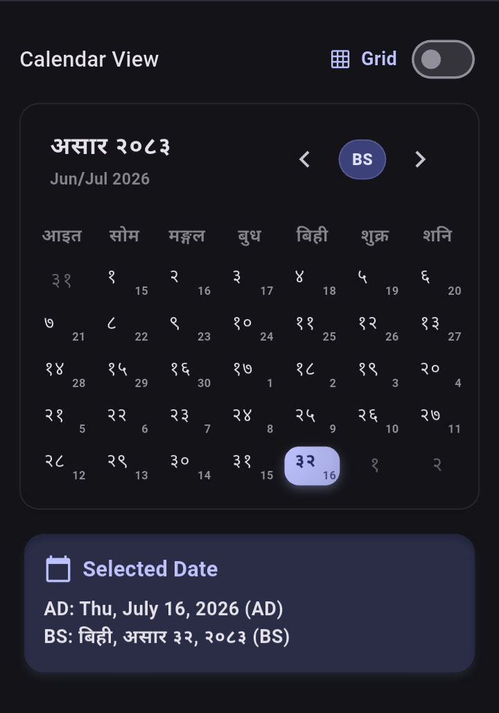
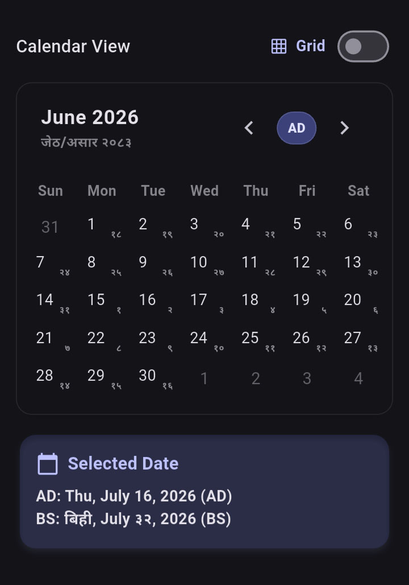
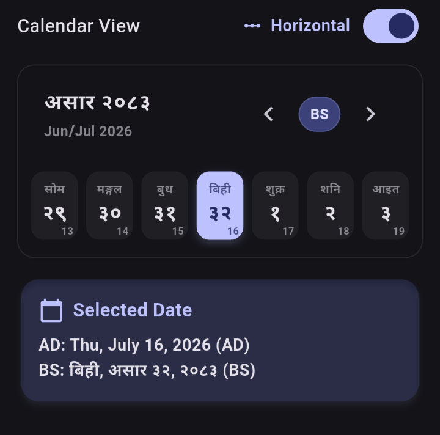
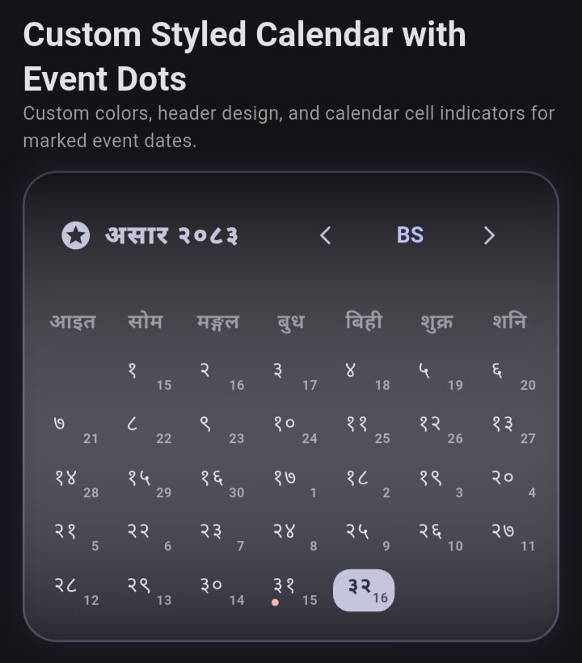
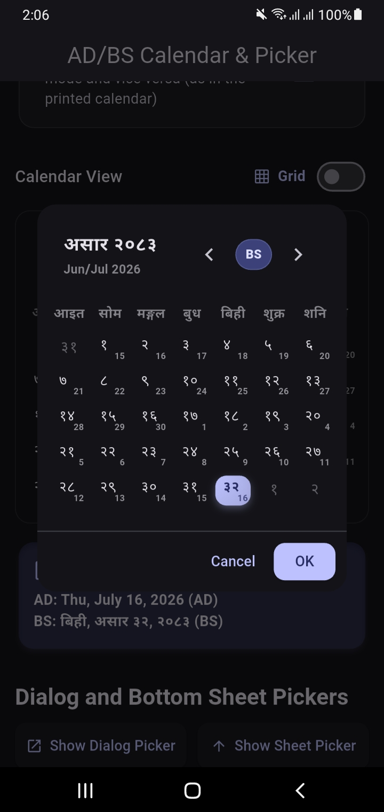
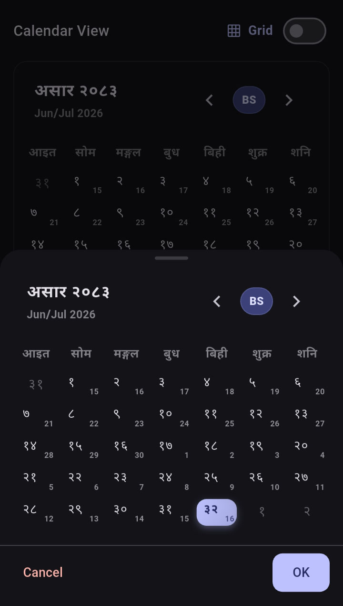

# Nepali & English Calendar

A highly customizable, beautiful calendar and date picker package for Flutter that supports both Gregorian (AD) and Bikram Sambat (BS) calendar systems. It provides standard month grid view, horizontal single-row scrollable view, and dynamic AD/BS switching out of the box.

## Screenshots

<table>
  <tr>
    <td align="center"><b>Nepali Calendar (BS)</b></td>
    <td align="center"><b>English Calendar (AD)</b></td>
  </tr>
  <tr>
    <td></td>
    <td></td>
  </tr>
  <tr>
    <td align="center"><b>Horizontal Strip View</b></td>
    <td align="center"><b>Custom Badges & Styling</b></td>
  </tr>
  <tr>
    <td></td>
    <td></td>
  </tr>
  <tr>
    <td align="center"><b>Dialog Picker</b></td>
    <td align="center"><b>Bottom Sheet Picker</b></td>
  </tr>
  <tr>
    <td></td>
    <td></td>
  </tr>
</table>

---

## Supported Platforms 📱

| Platform | Supported | Details |
|---|---|---|
| **Android** | ✅ | Fully compatible |
| **iOS** | ✅ | Fully compatible |
| **Web** | ✅ | Fully compatible |
| **macOS** | ✅ | Fully compatible |
| **Windows** | ✅ | Fully compatible |
| **Linux** | ✅ | Fully compatible |

---

## Features

- **Dual Calendar Systems**: Seamlessly toggle between English (AD) and Nepali (BS) calendars.
- **Dynamic Switching**: Built-in support to switch between AD and BS modes in real-time.
- **Horizontal Scrollable Calendar**: Toggle between a standard month grid layout and a single-row horizontally scrollable strip view (week-strip style).
- **Fully Customizable UI**: Developers can replace each component (headers, weekday indicators, individual date cells) using custom builders.
- **Beautiful Default Aesthetics**: Clean, modern cards with rounded corners, subtle shadows, color gradients, and transitions.
- **Dialog & Bottom Sheet Pickers**: Simple functions to launch date pickers in pop-up dialogs or slide-up bottom sheets.
- **Digit Transliteration**: Optional transliteration of calendar digits to Nepali script (e.g. `1` to `१`, `July` to `असार`).

---

## Installation

Add `nepali_english_dual_calendar` to your `pubspec.yaml` dependencies:

```yaml
dependencies:
  nepali_english_dual_calendar: ^0.0.1
```

or run `flutter pub add nepali_english_dual_calendar`. A single import exposes every widget, model, controller, and picker:

```dart
import 'package:nepali_english_dual_calendar/nepali_english_dual_calendar.dart';
```

---

## Quick Start

Instantly display a localized calendar inside your widget tree:

```dart
import 'package:flutter/material.dart';
import 'package:nepali_english_dual_calendar/nepali_english_dual_calendar.dart';

Widget build(BuildContext context) {
  return CalendarWidget(
    enableModeToggle: true, // lets users toggle between AD/BS modes
    useNepaliScript: true,  // converts calendar digits/texts to Nepali script
    onDateSelected: (date) {
      print('Selected date: $date');
    },
  );
}
```

---

## Usage

### 1. Basic Calendar Widget

To render a standard calendar in your app:

```dart
import 'package:flutter/material.dart';
import 'package:nepali_english_dual_calendar/nepali_english_dual_calendar.dart';

class CalendarScreen extends StatelessWidget {
  @override
  Widget build(BuildContext context) {
    return Scaffold(
      appBar: AppBar(title: Text('Calendar')),
      body: Padding(
        padding: const EdgeInsets.all(16.0),
        child: CalendarWidget(
          enableModeToggle: true,
          useNepaliScript: false,
        ),
      ),
    );
  }
}
```

### 2. Controlled Calendar with Selection Callback

Use `CalendarController` to track selection changes, jump to dates, or programmatically shift views/modes:

```dart
class ControlledCalendar extends StatefulWidget {
  @override
  _ControlledCalendarState createState() => _ControlledCalendarState();
}

class _ControlledCalendarState extends State<ControlledCalendar> {
  late CalendarController _controller;

  @override
  void initState() {
    super.initState();
    _controller = CalendarController(
      calendarMode: CalendarMode.ad,
      calendarFormat: CalendarFormat.monthGrid,
    );

    // Listen to changes
    _controller.addListener(() {
      print("Selected date: ${_controller.selectedDate}");
      print("Current mode: ${_controller.calendarMode}");
    });
  }

  @override
  void dispose() {
    _controller.dispose();
    super.dispose();
  }

  @override
  Widget build(BuildContext context) {
    return Column(
      children: [
        CalendarWidget(controller: _controller),
        ElevatedButton(
          onPressed: () {
            // Jump to today
            _controller.selectDate(CalendarDate.now());
          },
          child: Text('Reset to Today'),
        ),
        ElevatedButton(
          onPressed: () {
            // Toggle view style
            _controller.setCalendarFormat(
              _controller.calendarFormat == CalendarFormat.monthGrid
                  ? CalendarFormat.horizontalStrip
                  : CalendarFormat.monthGrid,
            );
          },
          child: Text('Toggle Layout'),
        ),
      ],
    );
  }
}
```

### 3. Date Picker Dialog & Bottom Sheet

Quickly display date pickers using the utility functions:

```dart
// Launch Date Picker Dialog
final CalendarDate? pickedDate = await showNepaliEnglishDatePicker(
  context: context,
  initialDate: CalendarDate.now(),
  useNepaliScript: true,
);

// Launch Date Picker Bottom Sheet
final CalendarDate? pickedDateSheet = await showNepaliEnglishDatePickerBottomSheet(
  context: context,
  initialDate: CalendarDate.now(),
  enableModeToggle: true,
);
```

### 4. Custom Component Builders (Full Custom Styling)

You can customize each component using builder methods. Here is how to create a custom day builder to highlight event dates with a red dot indicator:

```dart
CalendarWidget(
  dayBuilder: (context, date, state) {
    final hasEvent = myEventsList.contains(date.toString());
    
    return GestureDetector(
      onTap: state.isDisabled ? null : () => myController.selectDate(date),
      child: Container(
        margin: const EdgeInsets.all(4.0),
        decoration: BoxDecoration(
          color: state.isSelected ? Colors.amber : Colors.transparent,
          borderRadius: BorderRadius.circular(8),
        ),
        alignment: Alignment.center,
        child: Column(
          mainAxisAlignment: MainAxisAlignment.center,
          children: [
            Text(
              '${date.day}',
              style: TextStyle(
                color: state.isSelected ? Colors.white : Colors.black,
              ),
            ),
            if (hasEvent)
              Container(
                width: 4,
                height: 4,
                decoration: BoxDecoration(
                  color: Colors.red,
                  shape: BoxShape.circle,
                ),
              ),
          ],
        ),
      ),
    );
  },
)
```

### 5. Advanced Configuration (Dual Date Display & Custom Typography)

You can display both calendars simultaneously and apply custom localized typography:

```dart
CalendarWidget(
  controller: _controller,
  useNepaliScript: true, // Enables nepali numbers & months in BS mode
  nepaliFontFamily: 'MyNepaliFont', // Applies custom Nepali font to all BS texts
  showAlternativeDate: true, // Displays Gregorian date in BS cells and vice-versa
)
```

Both `showNepaliEnglishDatePicker` and `showNepaliEnglishDatePickerBottomSheet` helper methods also accept `nepaliFontFamily` and `showAlternativeDate` to keep picker popups fully customized and styled.

---

## Core Models

### `CalendarDate`

Represents a single unified date holding both AD and BS representations.
- `DateTime ad`: Gregorian representation.
- `NepaliDateTime bs`: Bikram Sambat representation.
- `CalendarMode mode`: Current active representation (`CalendarMode.ad` or `CalendarMode.bs`).
- `int year`, `int month`, `int day`, `int weekday`: Evaluated dynamically depending on the active mode.
- `int weekdayIndex`: Standardized index from `0` (Sunday) to `6` (Saturday).
- `bool isToday`: Returns `true` if the date represents today.
- `bool isSameDay(CalendarDate other)`: Checks day equality.
- `CalendarDate add(Duration duration)`: Adds duration returning a new instance.
- `CalendarDate subtract(Duration duration)`: Subtracts duration.
